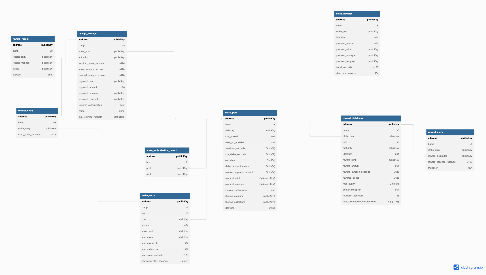

# Rewards-center

<p align="center">
    A rewards center for NFTs and FTs on Solana
</p>

# Background

Rewards center is a modular smart contract for staking tokens and distributing various rewards.

# Getting Started

While the deployments of this program are not live, you can deploy your own by using these steps. This will first clone the repo then run `make keys` will generate a new keypair for your program and update authority. NOTE: You must not lose these keypairs. Substitute your own keypair in if you would like to use your own.

> Note: You must not lose the keypairs! They will be saved in ./keypairs directory. To use your own keypairs place them there and skip the `make keys` step

```bash
git clone https://github.com/solana_nft_programs/rewards-center.git
make keys
make key-replace
make install
make build
solana airdrop 2 --url devnet keypairs/update-authority.json
solana program deploy --url devnet --keypair ./keypairs/update-authority.json --program-id ./keypairs/program-id.json ./target/deploy/solana_nft_programs_reward_center.so
```
# State map

<div style="text-align: center; width: 100%;">
  
</div>
